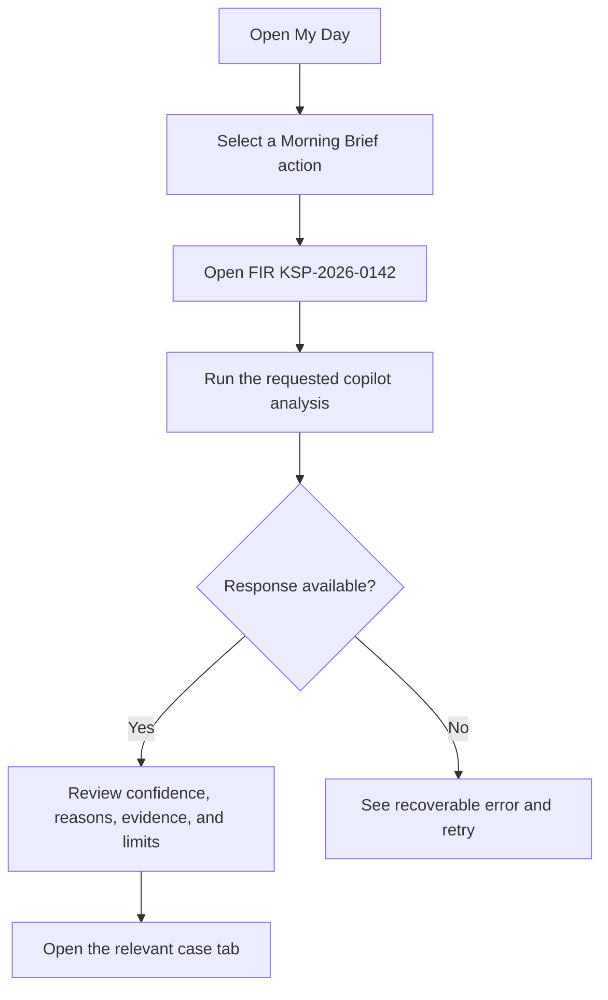
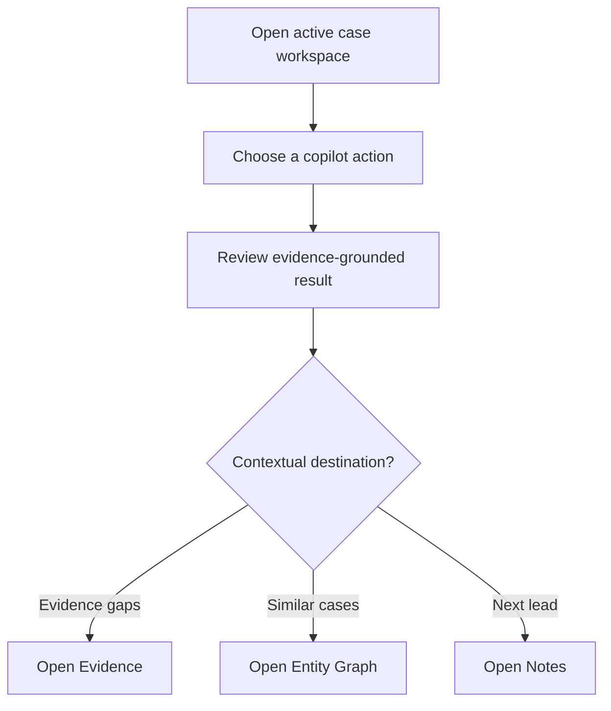
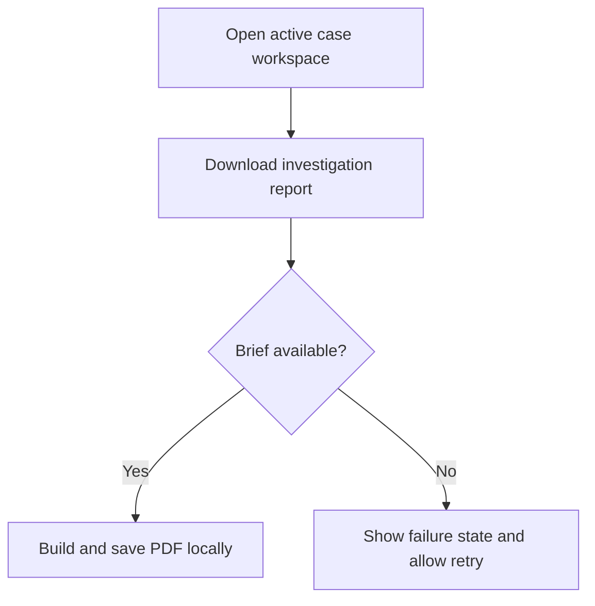

# Dogfood Report - codex/investigation-copilot

> Diff-scoped browser QA of `codex/investigation-copilot` vs `master`. Generated by `ce-dogfood` on 2026-07-22.

## Diff Summary

- Adds an evidence-grounded Investigation Copilot to the active case workspace.
- Connects Morning Brief actions to focused case tabs and copilot analyses.
- Adds a downloadable multi-section investigation intelligence report.
- Extends crime-chat responses with evidence gaps, next leads, similar cases, readiness, reasoning, provenance, confidence, and limitations.

## Personas

- **Investigating officer** - needs immediate, evidence-linked next actions without losing FIR context.
- **Supervisory officer** - needs transparent readiness and risk signals suitable for review and delegation.
- **SCRB analyst** - needs reproducible links between records, methods, and analytical conclusions.

Source: `PRODUCT.md`.

## Flows Tested

## Test Matrix & Results

| # | Flow | Journey / Scenario | Status | Issue | Fix | Commit |
|---|------|--------------------|--------|-------|-----|--------|
| 1 | Morning Brief | Open My Day, choose Explain why, land on the AI Brief with explanation loaded | Pass | - | - | `55b4216` |
| 2 | Copilot | Run all five analysis actions and inspect reasoning, evidence, confidence, and limitations | Pass | - | - | `55b4216` |
| 3 | Context navigation | Open Evidence, Entity Graph, and Notes from the matching copilot results | Pass | - | - | `55b4216` |
| 4 | Deep links | Refresh a case URL containing `tab` and `copilot` query parameters | Fixed | Hash-route tab changes previously corrupted the dashboard URL | Moved tab state to query parameters and added four route tests | `55b4216` |
| 5 | Report | Generate and download a non-empty PDF with the FIR identifier | Pass | - | Verified a 495,339-byte `application/pdf` blob | `55b4216` |
| 6 | Recovery | Force a failed analysis response, observe an announced error, and retry | Fixed | Failed analysis had no user recovery path | Added an announced fallback with Retry analysis | `55b4216` |
| 7 | Accessibility | Complete core interactions with keyboard focus visible | Fixed | New controls were undersized and focus treatment was incomplete | Added 44px targets, larger labels, live states, and visible focus | `55b4216` |
| 8 | Responsive | Complete the copilot journey at desktop and 390px mobile widths without overflow | Fixed | Header compressed the FIR; the strength gauge became a fixed yellow band | Restructured the header and separated gauge/detail selectors | `55b4216` |
| 9 | Regression | Build, lint, unit tests, production dependency audit, and console/network checks | Blocked (human decision) | Repository-wide lint baseline has 323 errors and 45 warnings outside this diff | Changed-file lint is clean; legacy cleanup remains separate work | `55b4216` |

## What Was Fixed

### Case tab navigation lost route context - `55b4216`
- **Symptom:** Switching workspace tabs could replace the hash route and leave the dashboard shell.
- **Root cause:** Tab state was encoded directly into `window.location.hash`.
- **Fix:** `client/src/Components/CaseWorkspace/caseWorkspaceRouting.js` preserves the case path and copilot query while changing tabs.
- **Regression test:** Four `node:test` cases cover supported, missing, invalid, and context-preserving routes.

### Copilot failures had no recovery path - `55b4216`
- **Symptom:** A failed reasoning request left only a generic fallback.
- **Root cause:** The response state did not distinguish service failures or normalize malformed arrays and confidence values.
- **Fix:** Normalized result payloads, bounded confidence, announced errors, and added Retry analysis.
- **Regression test:** Browser fetch was forced to fail, then restored; retry returned an 88% evidence-grounded result.

### Active-case layout broke under constrained width - `55b4216`
- **Symptom:** The FIR title wrapped into three lines on desktop and the mobile strength gauge expanded across the viewport.
- **Root cause:** Header controls competed in one flex row, and the gauge reused the mobile detail-panel selector.
- **Fix:** Added a two-row header structure and separate `case-strength__gauge` and `case-strength__details` classes.
- **Regression test:** Browser replay at 1440px and 390px; mobile document width remained exactly 390px.

## Paper Cuts (by persona)

- **Investigating officer** - Copilot controls were 34-38px tall with 11px labels - medium - fixed `55b4216`.
- **Supervisory officer** - The active FIR identity was visually fragmented by the control row - high - fixed `55b4216`.
- **SCRB analyst** - AI Brief used emoji and decorative gradients while adjacent tools used Phosphor and solid states - low - fixed `55b4216`.

## Console Errors

No runtime errors or failed feature requests remained. Development mode reports the existing React Router v7 future-flag warning.

## Human Verifications

Real CCTNS records and live Catalyst services are not available in the local synthetic-data environment. PDF structure was verified from the generated browser blob; legal and evidentiary accuracy still requires an authorized officer using live data.

## Decisions for a Human

### Repository-wide lint baseline
- **What's broken:** `npm run lint` reports 323 errors and 45 warnings across legacy screens not changed by this branch.
- **Why escalated:** Fixing hundreds of unrelated files would materially expand this feature branch and its regression surface.
- **Options:** Establish a lint baseline and burn it down incrementally, or run a dedicated repository cleanup branch.
- **Recommendation:** Use a dedicated cleanup branch while keeping changed-file lint mandatory in feature work.

## Learnings

- Query parameters are the stable place for nested workspace state inside this HashRouter application.
- Error recovery must be tested by forcing the actual browser fetch path, because the local mock layer intercepts network routing.
- Similar visual selectors for a gauge and popover can create severe mobile-only regressions; class names should encode component role precisely.

## Final Status

Feature journeys are ready for prototype use: all nine browser scenarios were exercised, with eight passing or fixed. Automated routing tests, production build, changed-file lint, backend syntax checks, and the production dependency audit are green. Repository-wide lint remains red from pre-existing debt, and live Catalyst/CCTNS validation remains a human verification.
